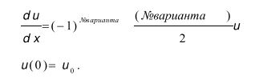
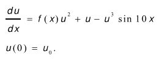
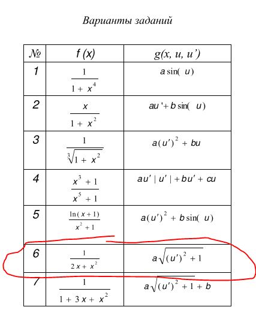

Лабораторная работа №1.
Численное решение задачи Коши для ОДУ
========

Над задачей работали:
> Сумин Игорь, Никита Мешалкин

##Тестовая задача

##Основная задача №1

##Основная задача №2

##Вариант задания №6

